# NFT Ticketing System - Complete Flow Diagram

This document provides a comprehensive flowchart showing how the NFT Ticketing System works from start to finish, covering all user journeys and system interactions.

---

## System Architecture Overview

---

## Complete User Journey Flowchart

---

## Organizer Journey - Event Creation Flow

```mermaid
graph TD
    ORG_START([Organizer Logged In]) --> APPLY{Is Approved<br/>Organizer?}
    
    APPLY -->|No| APPLY_ORG[Apply to Become Organizer<br/>Submit Application]
    APPLY_ORG --> WAIT[Wait for Admin Approval]
    WAIT --> APPROVED{Approved?}
    APPROVED -->|No| END1([Access Denied])
    APPROVED -->|Yes| CREATE_EVENT
    
    APPLY -->|Yes| CREATE_EVENT[Navigate to Create Event Page]
    
    CREATE_EVENT --> FORM[Fill Event Details Form]
    FORM --> DETAILS["• Event Name<br/>• Organizer Name<br/>• Event Date<br/>• Sale End Date<br/>• Ticket Price (ETH)<br/>• Total Tickets<br/>• Event Poster Image<br/>• Ticket Template Image"]
    
    DETAILS --> UPLOAD_IMAGES[Upload Images to IPFS]
    UPLOAD_IMAGES --> IPFS_CID[Receive IPFS CIDs<br/>Poster & Ticket]
    
    IPFS_CID --> DEPLOY_CONTRACT[Call Smart Contract<br/>createSale Function]
    
    DEPLOY_CONTRACT --> BLOCKCHAIN["Blockchain Transaction<br/>• Validate inputs<br/>• Create ticket struct<br/>• Store on-chain<br/>• Emit TicketCreated event"]
    
    BLOCKCHAIN --> BACKEND_SYNC[Backend Event Indexer<br/>Detects New Event]
    BACKEND_SYNC --> SAVE_DB[Save Event to MongoDB<br/>with Contract Details]
    
    SAVE_DB --> EVENT_LIVE([Event Published & Live!])
    
    EVENT_LIVE --> MANAGE[Organizer Can:<br/>• View Sales Analytics<br/>• Manage Tickets<br/>• Approve Transfers<br/>• Reset Quantities]
    
    style ORG_START fill:#8b5cf6,color:#fff
    style DEPLOY_CONTRACT fill:#3b82f6,color:#fff
    style BLOCKCHAIN fill:#10b981,color:#fff
    style EVENT_LIVE fill:#f59e0b,color:#fff
```

---

## User Journey - Ticket Purchase Flow

```mermaid
graph TD
    USER_START([User Logged In]) --> BROWSE_EVENTS[Browse Available Events]
    
    BROWSE_EVENTS --> SELECT[Select Event to View Details]
    SELECT --> EVENT_DETAIL["View Event Information:<br/>• Event Name & Date<br/>• Organizer<br/>• Price<br/>• Available Tickets<br/>• Poster Image"]
    
    EVENT_DETAIL --> CHECK_WALLET{Already Own<br/>Ticket for<br/>This Event?}
    
    CHECK_WALLET -->|Yes| ALREADY_OWN[❌ Cannot Purchase<br/>1 Ticket Per Wallet Policy]
    CHECK_WALLET -->|No| BUY_BUTTON[Click Buy Ticket]
    
    BUY_BUTTON --> METAMASK_CONFIRM[MetaMask Transaction Popup<br/>Confirm Payment]
    
    METAMASK_CONFIRM --> USER_APPROVE{User<br/>Approves?}
    USER_APPROVE -->|No| CANCEL([Purchase Cancelled])
    
    USER_APPROVE -->|Yes| BLOCKCHAIN_TX["Smart Contract Execution:<br/>• Verify payment amount<br/>• Check ticket availability<br/>• Enforce 1-per-wallet rule<br/>• Transfer ETH to organizer<br/>• Create new ticket instance<br/>• Mark user as ticket holder"]
    
    BLOCKCHAIN_TX --> TX_SUCCESS{Transaction<br/>Success?}
    
    TX_SUCCESS -->|No| ERROR[❌ Transaction Failed<br/>Funds Returned]
    TX_SUCCESS -->|Yes| BACKEND_UPDATE[Backend Detects Purchase<br/>via Event Indexer]
    
    BACKEND_UPDATE --> DB_UPDATE[Update MongoDB:<br/>• Create purchase record<br/>• Link ticket to user<br/>• Update available count]
    
    DB_UPDATE --> PURCHASE_COMPLETE([✅ Purchase Complete!])
    
    PURCHASE_COMPLETE --> MY_TICKETS[View in My Tickets Page]
    
    style USER_START fill:#3b82f6,color:#fff
    style BLOCKCHAIN_TX fill:#10b981,color:#fff
    style PURCHASE_COMPLETE fill:#f59e0b,color:#fff
```

---

## Ticket Download & NFT Minting Flow

```mermaid
graph TD
    PURCHASED([User Has Purchased Ticket]) --> MY_TICKETS_PAGE[Navigate to My Tickets]
    
    MY_TICKETS_PAGE --> VIEW_TICKET[View Ticket Details]
    VIEW_TICKET --> DOWNLOAD_CHECK{Ticket Already<br/>Downloaded?}
    
    DOWNLOAD_CHECK -->|Yes| ALREADY_MINTED[✅ NFT Already Minted<br/>View/Print Ticket]
    DOWNLOAD_CHECK -->|No| DOWNLOAD_BTN[Click Download Ticket]
    
    DOWNLOAD_BTN --> CALL_CONTRACT[Call Smart Contract<br/>downloadTicket Function]
    
    CALL_CONTRACT --> VERIFY["Blockchain Verification:<br/>• Ticket exists<br/>• Ticket is sold<br/>• Caller is buyer<br/>• Not already downloaded<br/>• Not refunded"]
    
    VERIFY --> MINT_NFT[Mint ERC721 NFT<br/>to User's Wallet]
    
    MINT_NFT --> UPDATE_STATUS[Update Ticket Status:<br/>isDownloaded = true]
    
    UPDATE_STATUS --> EMIT_EVENT[Emit TicketDownloaded Event]
    
    EMIT_EVENT --> BACKEND_SYNC[Backend Syncs Status<br/>via Event Indexer]
    
    BACKEND_SYNC --> GENERATE_QR[Generate QR Code<br/>with Ticket ID]
    
    GENERATE_QR --> DISPLAY_TICKET["Display NFT Ticket:<br/>• Event Details<br/>• QR Code<br/>• Unique Ticket ID<br/>• Owner Wallet Address<br/>• Transfer Status"]
    
    DISPLAY_TICKET --> ACTIONS["User Can:<br/>• Print Ticket<br/>• View in Wallet<br/>• Request Transfer<br/>• Verify Authenticity"]
    
    ALREADY_MINTED --> ACTIONS
    
    style PURCHASED fill:#3b82f6,color:#fff
    style MINT_NFT fill:#8b5cf6,color:#fff
    style DISPLAY_TICKET fill:#10b981,color:#fff
```

---

## Ticket Transfer Flow (One-Time Only)

```mermaid
graph TD
    OWNER([Ticket Owner]) --> REQUEST_TRANSFER[Request Ticket Transfer]
    
    REQUEST_TRANSFER --> FILL_FORM["Fill Transfer Form:<br/>• Recipient Wallet Address<br/>• Reason for Transfer"]
    
    FILL_FORM --> SUBMIT_REQUEST[Submit Transfer Request<br/>to Backend]
    
    SUBMIT_REQUEST --> DB_SAVE[Save Transfer Request<br/>to MongoDB<br/>Status: Pending]
    
    DB_SAVE --> NOTIFY_ORG[Notify Event Organizer<br/>New Transfer Request]
    
    NOTIFY_ORG --> ORG_REVIEW{Organizer<br/>Reviews<br/>Request}
    
    ORG_REVIEW -->|Reject| REJECT_DB[Update Status: Rejected]
    REJECT_DB --> NOTIFY_USER_REJECT[Notify User: Rejected]
    
    ORG_REVIEW -->|Approve| CHECK_TRANSFER{Ticket Already<br/>Transferred<br/>Once?}
    
    CHECK_TRANSFER -->|Yes| REJECT_SECOND[❌ Cannot Transfer<br/>One-Time Transfer Policy]
    
    CHECK_TRANSFER -->|No| CHECK_RECIPIENT{Recipient<br/>Already Has<br/>Ticket?}
    
    CHECK_RECIPIENT -->|Yes| REJECT_DUP[❌ Cannot Transfer<br/>Recipient Already Owns Ticket]
    
    CHECK_RECIPIENT -->|No| EXECUTE_TRANSFER[Organizer Calls<br/>adminTransferTicket<br/>on Smart Contract]
    
    EXECUTE_TRANSFER --> BLOCKCHAIN_TRANSFER["Blockchain Execution:<br/>• Verify ownership<br/>• Check transfer count<br/>• Remove from sender<br/>• Add to recipient<br/>• Mark as Second Hand<br/>• Reset download status<br/>• Transfer NFT if minted"]
    
    BLOCKCHAIN_TRANSFER --> UPDATE_FLAGS["Update Mappings:<br/>• hasBoughtTicketForEvent[sender] = false<br/>• hasBoughtTicketForEvent[recipient] = true<br/>• isSecondHand = true"]
    
    UPDATE_FLAGS --> EMIT_TRANSFER[Emit TicketTransferred Event]
    
    EMIT_TRANSFER --> BACKEND_UPDATE[Backend Syncs Transfer<br/>Update MongoDB]
    
    BACKEND_UPDATE --> TRANSFER_COMPLETE([✅ Transfer Complete!])
    
    TRANSFER_COMPLETE --> NEW_OWNER[New Owner Can:<br/>• Download NFT Again<br/>• Get New QR Code<br/>• Cannot Transfer Again]
    
    TRANSFER_COMPLETE --> OLD_OWNER[Original Owner:<br/>• Loses Ticket<br/>• Can Buy Again for Event]
    
    style OWNER fill:#3b82f6,color:#fff
    style EXECUTE_TRANSFER fill:#8b5cf6,color:#fff
    style TRANSFER_COMPLETE fill:#10b981,color:#fff
```

---

## Ticket Verification Flow

```mermaid
graph TD
    VERIFY_START([Verification Request]) --> SCAN_QR[Scan QR Code<br/>or Enter Ticket ID]
    
    SCAN_QR --> GET_ID[Extract Ticket ID]
    
    GET_ID --> CALL_VERIFY[Call Smart Contract<br/>verifyTicket Function]
    
    CALL_VERIFY --> CHECK_EXISTS{Ticket<br/>Exists?}
    CHECK_EXISTS -->|No| INVALID1[❌ Invalid Ticket]
    
    CHECK_EXISTS -->|Yes| CHECK_DOWNLOADED{NFT<br/>Minted?}
    CHECK_DOWNLOADED -->|No| INVALID2[❌ Ticket Not Downloaded]
    
    CHECK_DOWNLOADED -->|Yes| CHECK_REFUNDED{Ticket<br/>Refunded?}
    CHECK_REFUNDED -->|Yes| INVALID3[❌ Ticket Refunded]
    
    CHECK_REFUNDED -->|No| CHECK_OWNER{Caller Owns<br/>NFT?}
    CHECK_OWNER -->|No| INVALID4[❌ Not Ticket Owner]
    
    CHECK_OWNER -->|Yes| VALID[✅ Valid Ticket!]
    
    VALID --> DISPLAY_INFO["Display Ticket Info:<br/>• Event Name<br/>• Event Date<br/>• Owner Address<br/>• Ticket Status<br/>• Transfer History<br/>• Second Hand Status"]
    
    DISPLAY_INFO --> ADMIN_VERIFY{Admin/Organizer<br/>Verification?}
    
    ADMIN_VERIFY -->|Yes| MARK_USED[Mark Ticket as Used<br/>in Database]
    ADMIN_VERIFY -->|No| END_VERIFY([Verification Complete])
    
    MARK_USED --> END_VERIFY
    
    style VERIFY_START fill:#3b82f6,color:#fff
    style VALID fill:#10b981,color:#fff
    style INVALID1 fill:#ef4444,color:#fff
    style INVALID2 fill:#ef4444,color:#fff
    style INVALID3 fill:#ef4444,color:#fff
    style INVALID4 fill:#ef4444,color:#fff
```

---

## Backend Event Indexer - Blockchain Sync Flow

---

## System Policies & Enforcement

### 🚫 One-Time Transfer Policy

**Enforcement:**
- Smart contract tracks `isSecondHand` flag
- Once transferred, flag is set to `true`
- Second transfer attempt is blocked on-chain

---

### 👤 One Ticket Per Wallet Policy

```mermaid
graph TD
    USER[User Wallet] --> CHECK{Has Ticket<br/>for Event?}
    CHECK -->|No| ALLOW[✅ Can Purchase]
    CHECK -->|Yes| BLOCK[❌ Cannot Purchase]
    
    ALLOW --> PURCHASE[Purchase Ticket]
    PURCHASE --> FLAG[Set hasBoughtTicketForEvent = true]
    
    style USER fill:#3b82f6,color:#fff
    style ALLOW fill:#10b981,color:#fff
    style BLOCK fill:#ef4444,color:#fff
```

**Enforcement:**
- Smart contract maintains `hasBoughtTicketForEvent` mapping
- Checked before every purchase
- Reset only on transfer or refund

---

## Technology Stack Summary

| Layer | Technology | Purpose |
|-------|-----------|---------|
| **Frontend** | React + Vite | User interface |
| **Styling** | TailwindCSS | Responsive design |
| **Wallet** | MetaMask | Blockchain interaction |
| **Backend** | Node.js + Express | API server |
| **Database** | MongoDB | Off-chain data storage |
| **Authentication** | JWT | User sessions |
| **Blockchain** | Hardhat / Sepolia | Smart contract deployment |
| **Smart Contract** | Solidity (ERC721) | NFT ticket logic |
| **Storage** | IPFS (Pinata) | Decentralized image storage |
| **Sync** | Event Indexer | Blockchain-DB synchronization |

---

## Key Features Implementation

### ✅ Implemented Features

1. **NFT-Based Tickets** - Each ticket is a unique ERC721 token
2. **IPFS Storage** - Decentralized storage for event images
3. **Wallet Authentication** - MetaMask-based login
4. **Role-Based Access** - Organizers vs Regular Users
5. **One-Time Transfer** - Tickets can only be transferred once
6. **One Ticket Per Wallet** - Prevents bulk buying
7. **Transfer History** - Tracks "Transferred From" address
8. **Second Hand Marking** - Transferred tickets are marked
9. **Real-Time Sync** - Blockchain state synced to database
10. **QR Code Verification** - Scan to verify ticket authenticity
11. **Admin Controls** - Organizers can manage their events
12. **Automatic Refunds** - Expired unpurchased tickets refunded

---

## API Endpoints Overview

### Authentication Routes (`/api/auth`)
- `POST /register` - Register new user with wallet
- `POST /login` - Login with wallet signature
- `GET /me` - Get current user profile

### User Routes (`/api/users`)
- `GET /profile/:address` - Get user profile
- `PUT /profile` - Update user profile
- `POST /apply-organizer` - Apply to become organizer
- `GET /organizers` - List all organizers

### Event Routes (`/api/events`)
- `GET /` - List all events
- `GET /:id` - Get event details
- `POST /` - Create new event (organizer only)
- `PUT /:id` - Update event (organizer only)
- `DELETE /:id` - Delete event (organizer only)

### Purchase Routes (`/api/purchases`)
- `GET /my-tickets` - Get user's tickets
- `POST /` - Record purchase
- `GET /:id` - Get purchase details

### Transfer Routes (`/api/transfers`)
- `POST /request` - Request ticket transfer
- `GET /pending` - Get pending transfer requests
- `POST /approve/:id` - Approve transfer (organizer)
- `POST /reject/:id` - Reject transfer (organizer)

---

## Deployment Flow

```mermaid
graph TD
    START([Development Complete]) --> LOCAL_TEST[Test on Hardhat Local]
    
    LOCAL_TEST --> TEST_PASS{Tests<br/>Pass?}
    TEST_PASS -->|No| FIX[Fix Issues]
    FIX --> LOCAL_TEST
    
    TEST_PASS -->|Yes| DEPLOY_TESTNET[Deploy to Sepolia Testnet]
    
    DEPLOY_TESTNET --> TESTNET_TEST[Test on Testnet<br/>with Real Users]
    
    TESTNET_TEST --> TESTNET_PASS{Ready for<br/>Production?}
    TESTNET_PASS -->|No| IMPROVE[Improve & Fix]
    IMPROVE --> DEPLOY_TESTNET
    
    TESTNET_PASS -->|Yes| AUDIT[Security Audit<br/>Smart Contract]
    
    AUDIT --> AUDIT_PASS{Audit<br/>Pass?}
    AUDIT_PASS -->|No| FIX_SECURITY[Fix Security Issues]
    FIX_SECURITY --> AUDIT
    
    AUDIT_PASS -->|Yes| DEPLOY_MAINNET[Deploy to Ethereum Mainnet]
    
    DEPLOY_MAINNET --> PRODUCTION([🎉 Production Live!])
    
    style START fill:#3b82f6,color:#fff
    style DEPLOY_MAINNET fill:#8b5cf6,color:#fff
    style PRODUCTION fill:#10b981,color:#fff
```

---

## Conclusion

This NFT Ticketing System provides a complete, decentralized solution for event ticketing with the following key benefits:

- **Transparency** - All ticket transactions on blockchain
- **Security** - Smart contract enforcement of policies
- **Anti-Scalping** - One ticket per wallet, one-time transfer
- **Authenticity** - QR code verification against blockchain
- **Ownership** - Users truly own their NFT tickets
- **Decentralization** - IPFS storage, blockchain-based

The system successfully combines Web3 technology with traditional web development to create a modern, secure, and user-friendly ticketing platform.
